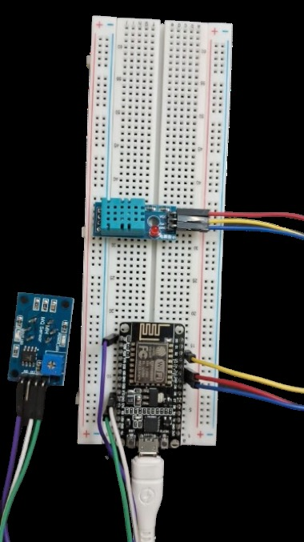

# Air Quality Monitoring System

Arduino + IoT-based system for real-time air quality tracking, using
gas and environmental sensors interfaced with a NodeMCU (ESP8266) for
WiFi connectivity and cloud/mobile app integration.

**Team**
- 23BEC1378 — Lakshmi Sanjeev
- 23BLC1060 — Neha Riona Alice K
- 23BLC1224 — Mirunalini A

---

## What it does

- Interfaces environmental sensors with a microcontroller for continuous
  air quality data acquisition (temperature, humidity, gas/smoke levels)
- Transmits sensor data in real time over WiFi for live monitoring
- Classifies air quality into simple bands (Good / Moderate / Poor /
  Hazardous) based on gas sensor readings
- Designed to feed a cloud dashboard / mobile app for remote monitoring
  and alerts

## Why

Air quality directly affects health — poor air quality is linked to
breathing problems and, over long exposure, more serious conditions.
Continuous, accessible monitoring makes it possible to notice problems
early and act on them, whether that's ventilating a room, avoiding a
polluted area, or evacuating a space where toxins are leaking.

## Components

| Component | Role |
|---|---|
| NodeMCU (ESP8266) | Main microcontroller — WiFi connectivity, runs the sketch in `firmware/` |
| DHT11 | Temperature & humidity sensor |
| MQ-series gas sensor | Detects smoke and gases (ammonia, sulfide, benzene series vapors, etc.) |
| Breadboard, jumper wires, connecting wires | Prototyping hardware |

See [`images/components`](images/components) for reference photos of each
part, and [`images/circuit-diagram.png`](images/circuit-diagram.png) /
[`images/hardware-setup.jpg`](images/hardware-setup.jpg) for the actual
wiring used in this build.

> The original design (see `docs/`) included additional sensors such as the MQ135, MQ2, MQ9, and a PM2.5 sensor connected through an Arduino Uno.
> However, the prototype built for this project uses a single MQ gas sensor and a DHT11 sensor connected directly to the NodeMCU,
> and the firmware in this repository shows that setup. Adding the remaining sensors from the original design is planned as a future improvement (see
> [Future Improvements](#future-improvements)).

## Circuit



| NodeMCU Pin | Connects to |
|---|---|
| D4 | DHT11 data pin |
| A0 | MQ sensor analog output |
| 3V3 / GND | Sensor power / ground rails |

## Firmware

The Arduino sketch lives in [`firmware/air_quality_monitor/`](firmware/air_quality_monitor).

1. Open `firmware/air_quality_monitor/air_quality_monitor.ino` in the Arduino IDE
2. Install the required libraries (listed at the top of the sketch): DHT sensor library, Adafruit Unified Sensor
3. Install the ESP8266 board package and select **NodeMCU 1.0 (ESP-12E Module)**
4. Edit `config.h` with your WiFi credentials and (optionally) your cloud endpoint
5. Flash and open the Serial Monitor at 115200 baud

By default the sketch runs in Serial-only mode (`SEND_TO_CLOUD = false`)
so you can verify sensor readings before wiring up any cloud/mobile app
integration.

## Functionality & Features

- **Real-time monitoring** — continuously collects temperature, humidity, and gas sensor data
- **Data logging** — data can be logged over time to analyze historical trends
- **Cloud integration** — sensor readings can be pushed to a cloud endpoint for remote access via web or mobile
- **Dashboard visualization** — pairs with a cloud dashboard (e.g. Arduino IoT Cloud, ThingSpeak) for graphs, charts, and widgets

## Applications

- Indoor/outdoor air quality safety monitoring
- Hospitals and chemical research centers — detecting toxin leakage and supporting evacuation decisions
- Vehicle emissions / traffic pollution monitoring
- Climate change research — studying air quality trends over time

## Future Improvements

- Extend to the full sensor array from the original design (MQ135, MQ2, MQ9, PM2.5) for more granular pollutant detection
- Trigger mechanical ventilation in smart-home setups before pollutant levels become unsafe
- Predictive modeling of air quality from historical data and weather patterns
- Swap in higher-accuracy, more sensitive sensors for a wider range of pollutants

## Repository Structure

```
.
├── firmware/
│   └── air_quality_monitor/
│       ├── air_quality_monitor.ino   # Main sketch
│       └── config.h                  # WiFi credentials, pins, thresholds
├── images/
│   ├── circuit-diagram.png           # Wiring reference (from design deck)
│   ├── hardware-setup.jpg            # Photo of the assembled prototype
│   └── components/                   # Reference photos of each part
├── media/
│   └── demo-video.mp4                # Demo of the working prototype
├── docs/
│   └── Air_Quality_Monitoring_System.pdf  # Original project presentation
├── LICENSE
└── README.md
```

## Demo

See [`media/demo-video.mp4`](media/demo-video.mp4) for a walkthrough of
the working prototype.

## License

This project is licensed under the MIT License — see [LICENSE](LICENSE) for details.
